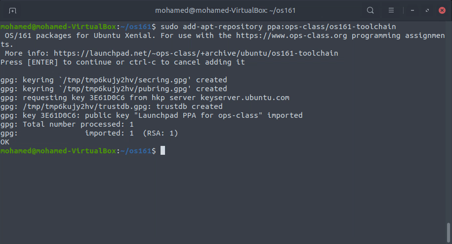
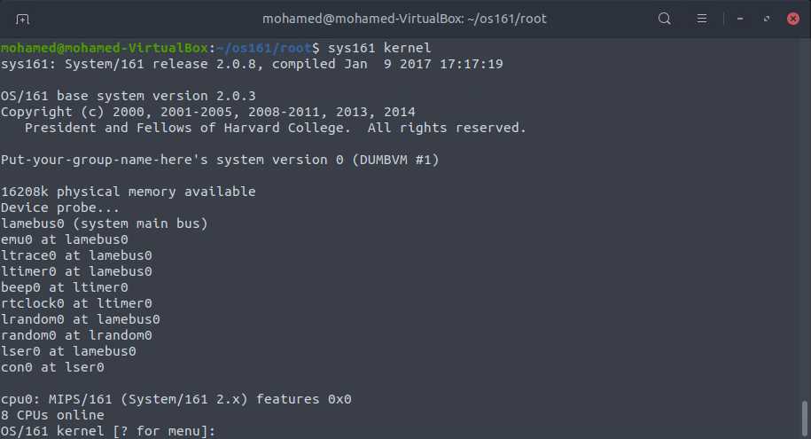
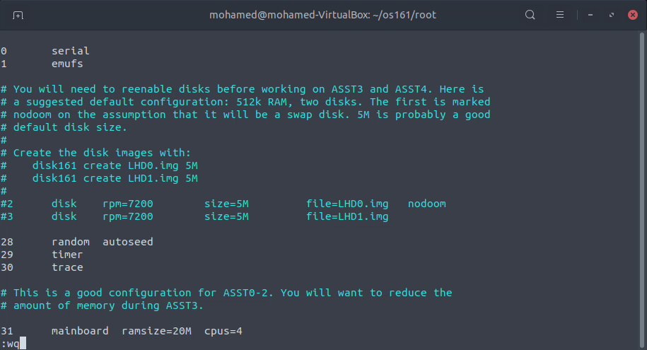

# [OS Lab Assignment](https://github.com/sudofix/os161/)
# First Let's Create A Virtual Machine

- Set Name, Operating System & Memory Size


- Go Through The Installation Process

## 

---

---

---

# Now Lets Run Our Virtual Machine

- First We Start Our Virtual Machine in The Background and Login to it

```
$ VBoxManage startvm lubuntu --type headless
$ ssh -p 3022 mohamed@localhost
```


#### Why Are We Doing This ?

- So We Can Use Our Virtual Machine From Host Termnal

---

---

---

# Now Let's Install Required Packages

- Lets install Git so We Can Clone Repositories

```
$ sudo apt-get install git
```


- and Let's Install Our C Compilers so we Can Use `make` and `bmake` Commands

```
$ sudo apt-get install build-essential
```


- Now Let's Install os161-toolchain

```
$ sudo add-apt-repository ppa:ops-class/os161-toolchain
$ sudo apt-get update
$ sudo apt-get install os161-toolchain
```




- Ok, Now Lets Clone os161 Repository Into Our src Directory
  - _note : i forked os161 repository to my github account so i can push the edits i make_

```
$ git clone https://github.com/sudofix/os161 src
```


---

---

---

# Now Let's Compile The Kernel

- First we Configure our src Directory

```
$ cd ~/os161/src
$ ./configure
```


- Now we Navigate to conf Directory and Configure it

```
$ cd ~/os161/src/kern/conf
$ ./config DUMBVM
```


- Now we go to DUMBVM folder and compile it

```
$ cd ~/os161/src/kern/compile/DUMBVM
$ bmake depend
$ bmake
$ bmake install
```


---

---

# Now Lets Run The Kernel

- Navigate to root Folder and Download Configuration file for sys161

```
$ cd ~/os161/root
$ wget https://www.ops-class.org/files/sys161.conf
```


- Now Let's Run The Kernel

```
$ sys161 kernel
```




---

---

---

# Editing sys161 conf File

- Lets Edit the conf File and Increase Ram and Decreaes CPUs

```
$ vim sys161.conf
```



- As We Can See here 20MB is too large for memory


- let's change it to 12MB


---

---

---

# Making Edits

- lets navigate to kern folder and create folder for our custom functions then create a C file to use for functions

```
$ cd ~/os161/src/kern
$ mkdir edits
$ touch info.c
```


- now lets edit our info.c file

```
$ vim info.c
```


- now lets navigate to include folder and create a header file and edit it

```
$ cd ~/os161/src/kern/include
$ touch info.h
$ vim info.h
```


- now lets navigate to conf folder and add our C file in conf.kern file

```
cd ~/os161/src/kern/conf
$ vim conf.kern
```


- now lets navigate to main folder and edit main.c
  - so we first add oue header file, edit some info and call our function

```
$ cd ~/os161/src/kern/main
$ vim main.c
```


- and let's edit version file to add our version

```
$ cd ~/os161/src/kern/include
$ vim version.c
```


- Now lets build the kernel again

```
$ cd ~/os161/src/kern/compile/DUMBVM
$ bmake clean
$ bmake depend
$ bmake
$ bmake install
```


- let's run the kernel again to see our modifications

```
$ cd ~/os161/root
$ sys161 kernel
```


---

---

---

# Extra Modifications

## Now i'm Going To Add To Functions two Our Kernel Menu. One is a Simple Calculator and The Other is an info one

---

- First Lets Create Our 2 Functions in `info.c` file we created earlier


- now we add our function prototypes in our header file `info.h`


- now let's include our `info.c` in `menu.c`


- we add auxiliary functions in the commands table


- we implement the auxiliary functions


- add options for our fucntion to menu


- and now let's recompile the kernel and see our new functions in the menu


- let's try our calculator


- and let's try the other function


